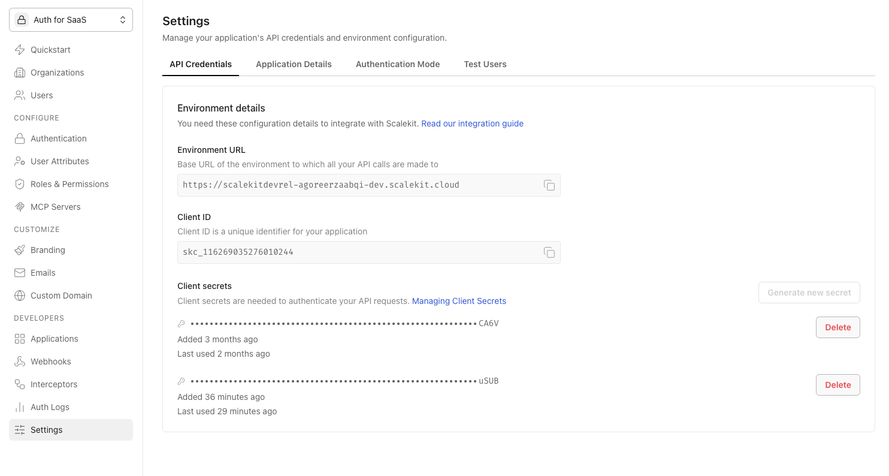
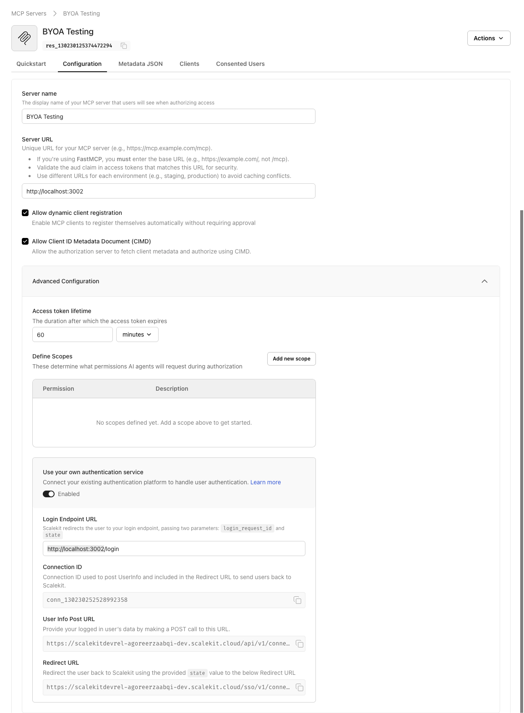

# BYOA MCP Server (Node.js)

A Node.js demo showing how to use Scalekit's **Bring Your Own Auth** (BYOA) for MCP servers.

Instead of Scalekit hosting the login UI, Scalekit redirects to your own login page. You authenticate the user with your existing auth system, send their details to Scalekit via the SDK, and Scalekit issues the MCP access token. Your users see a familiar login screen and no migration is needed.

See: [Scalekit BYOA docs](https://docs.scalekit.com/mcp/auth-methods/custom-auth/)

---

## How it works

```
MCP Client → Scalekit → GET /login?login_request_id=...&state=...
                               ↓
                         User submits credentials
                               ↓
                         POST user details to Scalekit SDK
                         (including custom claims like org_id, org_name)
                               ↓
                         Redirect → Scalekit callback
                               ↓
                         Scalekit issues MCP token
                         (custom claims embedded in token)
                               ↓
                         MCP server reads claims on every request
```

---

## Prerequisites

- Node.js v18+
- npm
- A Scalekit account — [app.scalekit.com](https://app.scalekit.com)

---

## Setup

### 1. Get your API credentials

Go to **Settings → API Credentials** in the Scalekit dashboard.



Copy these three values:

| Env var | Field in dashboard |
|---|---|
| `SK_ENV_URL` | Environment URL |
| `SK_CLIENT_ID` | Client ID |
| `SK_CLIENT_SECRET` | Client secrets → copy an existing secret or generate a new one |

### 2. Register the MCP server

Go to **MCP Servers** in the left nav and create a new server (or open an existing one).

Under the **Configuration** tab:

- **Server URL**: `http://localhost:3002` — this becomes your `EXPECTED_AUDIENCE`
- Check **Allow dynamic client registration**
- Check **Allow Client ID Metadata Document (CIMD)**

Copy the **MCP Server ID** shown at the top of the page (starts with `res_`) — this is your `MCP_SERVER_ID`.

### 3. Get the Protected Resource Metadata

Still on your MCP server page, click the **Metadata JSON** tab and copy the full JSON. Minify it (remove all whitespace) and use it as `PROTECTED_RESOURCE_METADATA`.

### 4. Enable Bring Your Own Auth

Still on the **Configuration** tab, scroll down to **Advanced Configuration** and expand it.



- Toggle **Use your own authentication service** → **Enabled**
- Set **Login Endpoint URL** to: `http://localhost:3002/login`
  _(Scalekit will redirect users here with `login_request_id` and `state` query params)_
- Copy the **Connection ID** (starts with `conn_`) — this is your `SK_CONNECTION_ID`

### 5. Configure environment variables

```sh
cp env.example .env
```

Fill in `.env`:

```env
PORT=3002
SK_ENV_URL=https://your-env.scalekit.cloud
SK_CLIENT_ID=skc_xxx
SK_CLIENT_SECRET=sks_xxx
SK_CONNECTION_ID=conn_xxx
MCP_SERVER_ID=res_xxx
PROTECTED_RESOURCE_METADATA='{"resource":"http://localhost:3002",...}'
EXPECTED_AUDIENCE=http://localhost:3002
```

### 6. Install, build, and run

```sh
npm install
npm run build
npm start
```

Server starts on `http://localhost:3002`.

### 7. Connect an MCP client

Add to your `mcp.json`:

```json
{
  "servers": {
    "byoa-greeting": {
      "url": "http://localhost:3002/",
      "type": "http"
    }
  }
}
```

Click **Start**. The MCP client triggers the OAuth flow, which redirects to `http://localhost:3002/login`.

### 8. Log in and test

Enter any email and password in the login form — the demo accepts any non-empty credentials. After login, Scalekit completes the OAuth flow and issues a token with your custom claims embedded.

Try these prompts:

- `Can you please greet Alice?` → uses `org_name` from the token
- `Who am I?` → returns your identity and custom claims from the token

---

## How custom claims work

In `src/login/handler.ts`, after authenticating the user, you pass any attributes you want to `updateLoginUserDetails`:

```typescript
const userAttributes = {
  org_id: 'org_acme_01',
  org_name: 'Acme Corp',
  // Add any claims your application needs — roles, subscription tier,
  // feature flags, tenant metadata, etc.
};

await scalekit.auth.updateLoginUserDetails(connectionId, loginRequestId, {
  sub: email,
  email,
  customAttributes: userAttributes,
});
```

Scalekit embeds these as `custom_claims` in the issued access token. The MCP server reads them on every request from the decoded JWT — no extra database call needed:

```typescript
// In any tool handler:
const claims = requestContext.getStore()?.claims;
const orgName = claims?.custom_claims?.org_name;
```

---

## Project structure

```
src/
├── main.ts                 # Express app, route wiring, AsyncLocalStorage init
├── config/config.ts        # Environment variable loading
├── lib/
│   ├── scalekit.ts         # Shared Scalekit client (token validation + login handshake)
│   ├── middleware.ts       # JWT validation, stores decoded claims in request context
│   ├── context.ts          # AsyncLocalStorage — passes claims to tool handlers
│   ├── auth.ts             # /.well-known/oauth-protected-resource handler
│   ├── transport.ts        # MCP StreamableHTTP transport (new instance per request)
│   └── logger.ts
├── login/
│   ├── handler.ts          # GET /login (serve form), POST /login/submit (BYOA handshake)
│   └── template.ts         # Login page HTML
└── tools/
    ├── index.ts            # Tool registry
    ├── greeting.ts         # greet_user — personalises greeting with org_name from token
    └── whoami.ts           # whoami — returns identity and custom claims from token
```

---

## Adapting for production

| Location | What to change |
|---|---|
| `src/login/handler.ts` | Replace the mock credential check with your real auth logic |
| `src/login/handler.ts` | Populate `userAttributes` from your user/org database instead of hardcoded values |
| `src/login/template.ts` | Replace with your actual login UI, or redirect to it instead of serving this page |

---

## License

See [LICENSE](../LICENSE).
